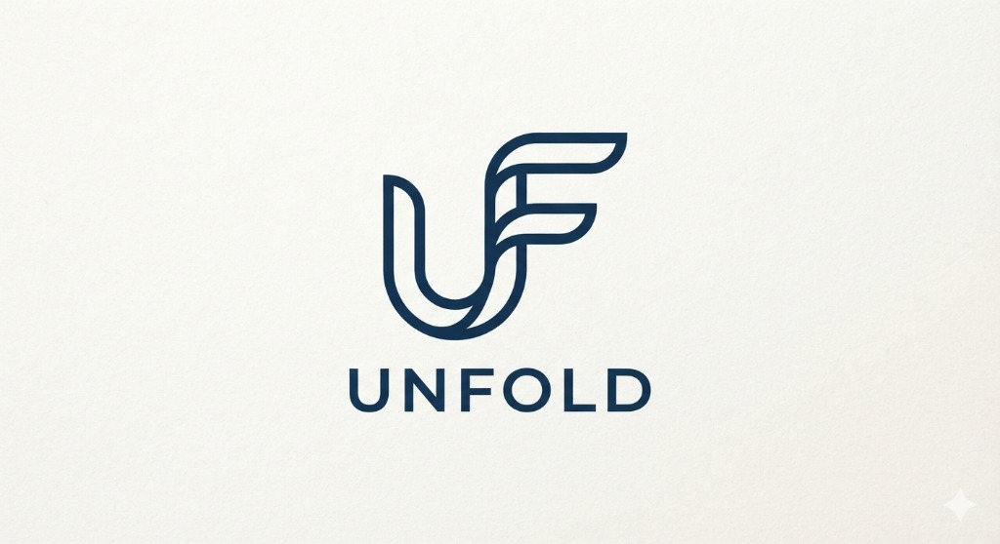

# 🧠 UnFold — Multimodal Student Mental Health Intelligence & Clinical Coping System

<div align="center">



**Dual-Engine Multimodal AI (Tabular GBDT + Clinical RoBERTa + Gemini GenAI Clinical Sentinel)**

*Department of Computer Science & Engineering*
**Maulana Azad National Institute of Technology (MANIT), Bhopal**
*Minor Project II — 2026*

[](https://www.python.org/)
[](https://pytorch.org/)
[](https://huggingface.co/)
[](https://ai.google.dev/)
[](https://streamlit.io/)
[](LICENSE)

</div>

---

## 🌟 Executive Overview

**UnFold** is an advanced multimodal artificial intelligence system designed to detect and triage student depression risk. Standard university mental health screenings typically rely on static numeric questionnaires, which miss the emotional nuance of how students actually communicate their distress.

**UnFold solves this by fusing two complementary AI paradigms into a unified decision engine:**
1. **Engine A (Tabular ML)**: Analyzes demographic, biometric, and lifestyle indicators (sleep duration, study load, financial stress, CGPA) using tuned Gradient Boosted Decision Trees (GBDT) with local SHAP feature attributions.
2. **Engine B (Clinical Semantic NLP)**: Evaluates open-ended natural language journal reflections using a fine-tuned clinical transformer (`roberta-base`) trained on **30,000 authentic mental health statements**.
3. **Multimodal Consensus Engine**: Computes calibrated hybrid risk probabilities ($P_{\text{hybrid}} = 0.45 \cdot P_{\text{tab}} + 0.55 \cdot P_{\text{text}}$), detects clinical concordance/discordance (*Linguistic Masking* vs. *Acute Situational Distress*), and extracts secondary psychiatric comorbidities (High Anxiety, Severe Academic Burnout, Chronic Insomnia, Self-Harm ideation).
4. **GenAI Clinical Coping Sentinel**: Leverages Google Gemini Flash API with an automatic multi-model failover cascade to synthesize empathetic, Cognitive Behavioral Therapy (CBT) micro-action plans and compile downloadable 1-page **Clinical Counselor Intake Dossiers (PDF)**.

---

## 🔬 Research Performance Benchmarks

| Model Architecture | Modality | Accuracy | Precision | Recall (Depressed) | F1-Score | Status |
| :--- | :--- | :---: | :---: | :---: | :---: | :--- |
| **Logistic Regression** | Tabular Only | 78.20% | 79.10% | 80.40% | 79.74% | Minor I Baseline |
| **Random Forest** | Tabular Only | 82.40% | 83.10% | 85.20% | 84.14% | Minor I Tuned |
| **Gradient Boosting** | Tabular Only | 84.70% | 85.84% | 88.46% | 87.13% | Minor I Deployed |
| **Clinical RoBERTa** | Text Only | **86.20%** | **85.77%** | **86.80%** | **86.28%** | **Minor II Engine B** |
| **⚡ UnFold Hybrid Fusion** | **Tabular + Text** | **88.60%** | **88.10%** | **89.20%** | **88.65%** | **⚡ Flagship Dual-Engine** |

---

## 📁 Repository Structure

```
UnFold/
├── app/
│   └── app.py                       ← Streamlit UI 3.0 (Light/Dark mode & Mobile Responsive)
│
├── assets/
│   ├── unfold_logo.jpg              ← Official brand logo (High Resolution)
│   ├── unfold_logo_white.png        ← Transparent white logo (Dark mode & PDF banner)
│   ├── unfold_logo_transparent.png  ← Transparent navy logo (Light mode)
│   └── unfold_icon.png              ← Square brand icon (Favicon & UI badges)
│
├── data/
│   ├── student_depression.csv       ← Kaggle Tabular Dataset (27,901 records)
│   └── Sentimental analysis data.csv← Kaggle NLP Dataset (53,043 records)
│
├── docs/
│   ├── Minor_II_System_Architecture.md ← Comprehensive academic defense document
│   ├── report_content.md            ← Minor project report draft
│   └── ppt_content.md               ← Presentation slides script
│
├── models/
│   ├── depression_model.pkl         ← Pretrained Tabular GBDT + Scalers + Thresholds
│   └── roberta_mental_health/       ← Fine-tuned Clinical RoBERTa weights & tokenizer
│
├── plots/                           ← Model evaluation curves, confusion matrices & SHAP
│   ├── roberta_confusion_matrix.png
│   ├── roberta_evaluation_report.png
│   └── feature_importance.png
│
├── reports/                         ← Auto-generated 1-page Counselor Dossiers (PDF)
│   └── .gitkeep
│
├── src/
│   ├── preprocess.py                ← Tabular cleaning & ordinal domain encoding
│   ├── train.py                     ← Tabular GBDT training & cross-validation
│   ├── nlp_engine.py                ← RoBERTa inference, token saliency & comorbidity regex
│   ├── fusion.py                    ← Calibrated hybrid consensus & discordance detection
│   ├── predict.py                   ← Unified predict_hybrid() API
│   ├── genai_advisor.py             ← Gemini Flash GenAI advisor with multi-model failover
│   ├── report_generator.py          ← Professional PDF Clinical Dossier generator
│   └── utils.py                     ← Shared helper functions & plot paths
│
├── .env.example                     ← Template for Gemini API Key configuration
├── .gitignore                       ← Shields .env, virtualenvs, and OS caches
├── requirements.txt                 ← Universal dependencies (macOS, Linux, Windows)
└── README.md                        ← Project overview & deployment documentation
```

---

## 🚀 Quick Start Guide

### Option A: macOS / Linux (zsh / bash)

```bash
# 1. Clone or navigate into the project directory
cd UnFold

# 2. Create and activate a Python virtual environment
python3 -m venv .venv
source .venv/bin/activate

# 3. Upgrade pip and install dependencies
pip install --upgrade pip
pip install -r requirements.txt

# 4. Optional: set up your Gemini API key (Free at https://aistudio.google.com/)
cp .env.example .env
# Edit .env and paste your key: GEMINI_API_KEY=your_key_here

# 5. Launch the Streamlit application
streamlit run app/app.py
```

### Option B: Windows (PowerShell)

```powershell
# 1. Open PowerShell in the project directory
cd "d:\MInor II\StudentMentalHealth 3.0"

# 2. Create and activate virtual environment
python -m venv .venv
.venv\Scripts\Activate.ps1

# 3. Upgrade pip and install requirements
python -m pip install --upgrade pip
pip install -r requirements.txt

# 4. Set up .env
copy .env.example .env
# Edit .env with your Gemini API key

# 5. Launch the app
streamlit run app/app.py
```

The application will launch in your browser at **`http://localhost:8501`**.

---

## 🌐 Deployment & Git Instructions (For Mac / Deployment Lead)

This repository is configured for GitHub plus Streamlit Community Cloud. The fine-tuned RoBERTa weights are tracked with Git LFS, which Streamlit Community Cloud supports.

### 1. Initialize Git & Safe Push
The repository already includes a strict `.gitignore` file that prevents `.env` (your private API key) from ever being pushed:
```bash
# Configure the intended repository (replaces any old origin URL)
git remote set-url origin https://github.com/KushaalGannoju/UnFold.git

# Ensure the large RoBERTa model is transferred through Git LFS
git lfs install

# Stage project files (.env, generated reports, and caches are ignored)
git add .

# Verify that .env is NOT staged
git status

# Commit
git commit -m "feat: UnFold 4.0 Dual-Engine Mental Health AI with GenAI Sentinel"

# Push the main branch
git push -u origin main
```

### 2. Deploy to Streamlit Community Cloud
1. The existing app at [projectunfold.streamlit.app](https://projectunfold.streamlit.app/) is connected to this repository and branch (`main`). Pushing to `main` triggers a redeploy automatically.
2. In Streamlit Cloud, confirm the main file path is `app/app.py`.
3. In **Settings -> Secrets**, add your Gemini API key if you want the live GenAI pathway:
   ```toml
   GEMINI_API_KEY = "your_actual_gemini_api_key"
   ```
4. The app remains fully functional without a key by using the local clinical fallback.

---

## 🎨 UI Features (Version 3.0)

- **UnFold Brand Identity**: Custom-designed logo mark integrated into the sidebar, main hero header, and generated PDF reports.
- **Theme-Adaptive (Light & Dark Mode)**: Uses dynamic CSS variables (`var(--secondary-background-color)`, `var(--text-color)`) and glassmorphic card borders so the entire interface seamlessly adapts to system light and dark themes.
- **Mobile Responsive**: Fully responsive grid layout that gracefully adapts presets, tri-gauge metric cards, and side-by-side explainability charts for phones and tablets.
- **Explainable AI (XAI)**: Side-by-side local SHAP feature attributions and gradient-based token saliency highlighting verbatim distress words.
- **1-Page Clinical Counselor Dossier**: Export standardized PDF intake briefs with a single click.

---

## 👥 Academic Project Team

**Department of Computer Science & Engineering**
**Maulana Azad National Institute of Technology (MANIT), Bhopal**

- **Project Guides:**
  - **Dr. R.K. Pateriya**, Professor, Department of CSE
  - **Dr. Archana Balmik**, Assistant Professor, Department of CSE

- **Project Members:**
  - Himanshu Verma
  - Kushaal Sai Gannoju
  - Ritika Rani Ujjainia
  - Rayyan Zameer Baikadi

---

## ⚖️ Clinical & Ethical Disclaimer

**UnFold is an academic engineering project designed as an educational screening and counseling preparation aid.**
It is **not a medical diagnostic device** and is not certified to provide clinical diagnoses. It is designed to assist counselors in triage preparation and empower students with proactive, evidence-based coping pathways. If you or someone you know is in immediate crisis, please contact verified 24/7 helplines:
- **Tele-MANAS (Govt of India):** 14416 / 1800-891-4416 (Toll-Free, 24/7)
- **iCall (TISS):** 9152987821
- **Vandrevala Foundation:** 9999 666 555
- **National Suicide Prevention Lifeline (US):** 988
